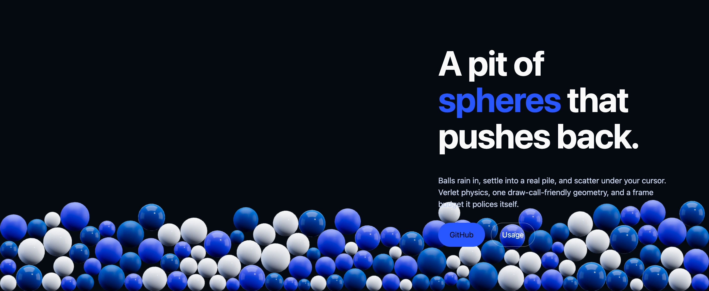
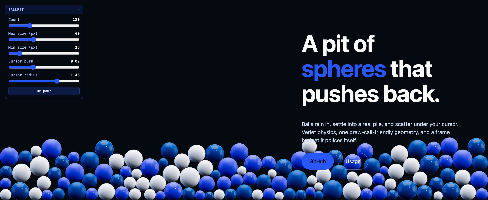

# ballpit-js

An interactive pit of spheres for hero sections. Balls rain into the container, settle into a real pile, and scatter when the cursor pushes through them.



No canvas library to learn, no physics engine to bundle: one function, one container element, [three.js](https://threejs.org) as the only dependency.

```js
import { createBallpit } from 'ballpit-js';

createBallpit(document.querySelector('#hero-pit'), {
  count: 180,
  palette: ['#eaf1ff', '#2957ff', '#00509f'],
});
```

## Why it exists

Most decorative hero backgrounds are a looping video or a shader — pretty, but nothing happens when you touch them. This one is a small physics world: the balls stack on each other, hold their shape, and remember where you shoved them. It gives visitors something to fiddle with instead of scroll past.

It was built for [ozdalgic.com](https://ozdalgic.com) and pulled out into a library afterwards.

## Install

```bash
npm install ballpit-js three
```

The module imports the bare specifier `three`, so a bundler resolves it for you. Without a build step, add an import map:

```html
<script type="importmap">
  {
    "imports": {
      "three": "https://cdn.jsdelivr.net/npm/three@0.181.2/build/three.module.js",
      "ballpit-js": "./node_modules/ballpit-js/src/ballpit.js"
    }
  }
</script>
<script type="module">
  import { createBallpit } from 'ballpit-js';
  createBallpit(document.querySelector('#hero-pit'));
</script>
```

The container needs a size of its own — the canvas fills it:

```css
#hero-pit { position: absolute; inset: 0; z-index: 0; }
```

## Options

| Option | Default | What it does |
| --- | --- | --- |
| `count` | `180` | How many balls. Absolute, not a density — see [Sizing](#sizing). |
| `minSize` / `maxSize` | `25` / `60` | Ball diameters **in CSS pixels**, re-derived whenever the container resizes. |
| `palette` | `['#eaf1ff', '#2957ff', '#00509f']` | Colours, cycled across the balls. Each gets a glossy and a frosted material. |
| `gravity` | `11` | Downward acceleration in world units/s². |
| `drift` | `0` | Sideways acceleration. Negative makes the pile lean and re-gather to the left. |
| `pointer.radius` | `1.45` | Size of the invisible disc the cursor drags through the pile (~157px). |
| `pointer.strength` | `0.02` | Shove budget per step. See [Tuning the cursor](#tuning-the-cursor). |
| `envIntensity` | `0.45` | Environment reflection. Raise for wetter, more mirror-like balls. |
| `specular` / `clearcoat` | `0.3` / `0.12` | Grazing-angle reflectance and the coat on top of it. |
| `maxPixelRatio` | `1.5` | DPR cap. The retina pass is the single biggest fragment cost. |
| `autoQuality` | `true` | Shed balls if frames run long. See [Performance](#performance). |
| `budgetMs` | `8` | The frame cost that counts as "too slow". |
| `seed` | `20260907` | Fixed, so the pour is identical on every load. |
| `respectReducedMotion` | `true` | Render one settled frame instead of animating. |
| `controls` | `false` | Show the built-in tuning panel. |
| `labels` | English | Panel strings, for translating the UI. |

## API

```js
const pit = createBallpit(el, options);

pit.setCount(240);      // add or remove balls; new ones rain in
pit.setSizes(20, 45);   // min/max diameter in CSS px
pit.repour();           // replay the opening pour
pit.destroy();          // remove listeners, dispose GPU resources, drop the canvas
pit.canvas;             // the <canvas> element
```

## Tuning panel

Pass `controls: true` to get sliders for count, sizes and the cursor, plus a re-pour button. Useful while you dial a design in; leave it off in production (or keep it — it works fine as a toy for visitors).



## Sizing

`count` is a number of balls, not a density. The same value reads as a shallow bed in a wide hero and a deep drift in a narrow one, so pick it against your own container:

| Container | Reads as |
| --- | --- |
| ~1400 × 640 | `120` — a bed roughly two balls deep |
| ~1900 × 580 | `180` — the same depth across a wider hero |
| ~2500 × 610 | `180` — sparser, closer to a single layer |

Ball sizes are given in CSS pixels and re-derived on every resize, so a ball stays 60px whatever the viewport does.

## Tuning the cursor

`pointer.strength` is a hard cap on how far one ball may be displaced in a single step. It has to be re-tuned when the packing changes, and the useful range is narrow:

- Too high and a single drag bulldozes the whole bed into a mound — and with `drift: 0` nothing ever undoes that.
- Too low and a densely packed pile simply absorbs the push: neighbour contacts cancel it out within the same step and nothing visibly moves.

The default (`0.02`, with `radius: 1.45`) shoves nearby balls a few widths aside and leaves the bed's shape intact across repeated drags. Measured against 180 balls in a 1900 × 580 container.

## Performance

The solver is Verlet integration with positional relaxation over a uniform-grid broadphase, so cost scales with ball count rather than with its square. Everything shares one sphere geometry and a handful of materials.

Measured on an M4 Max, step + render per frame:

| Balls | ms/frame | Share of a 60fps budget |
| --- | --- | --- |
| 120 | 0.22 | 1% |
| 180 | 0.39 | 2% |
| 400 | 0.77 | 5% |

Those are one machine's numbers; a weak integrated GPU will be several times slower, and the fragment cost (not the physics) is what bites. `autoQuality` therefore times the real frames and drops to 60% of the balls if the median exceeds `budgetMs`. If you expose the count slider to visitors, the safety net stands down as soon as they touch it — their choice wins.

## Accessibility

- `prefers-reduced-motion: reduce` renders a single settled frame instead of animating.
- The pit is decorative; give the container `aria-hidden="true"` and keep your real content in normal DOM above it.
- The canvas never takes pointer events away from your content — it tracks the cursor from `window` instead.

## Browser support

Any browser with WebGL2 and ES modules. If WebGL is unavailable, `createBallpit` warns and returns a no-op controller rather than throwing, so the page is unaffected.

## Licence

MIT © [Aytaç Özdalgıç](https://ozdalgic.com)
